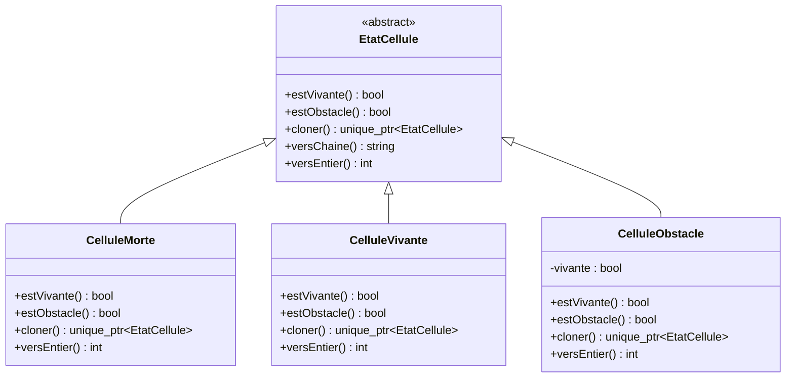
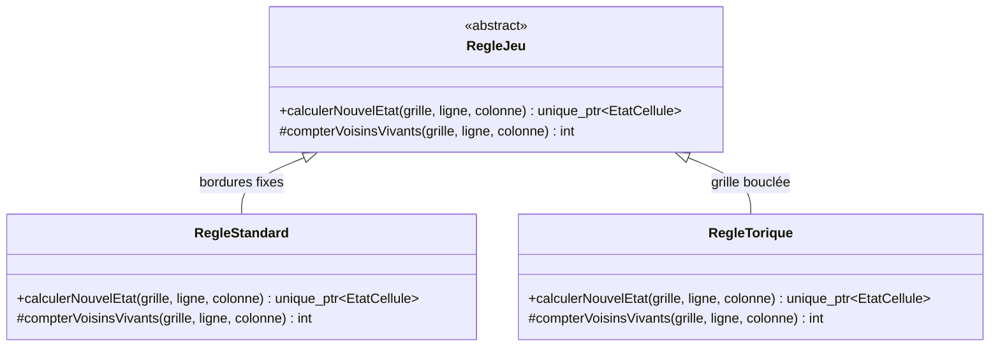
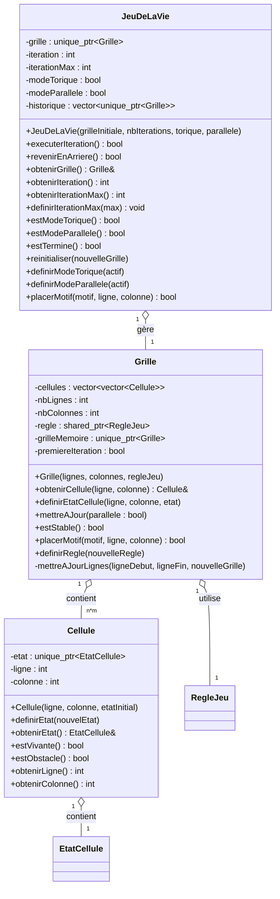
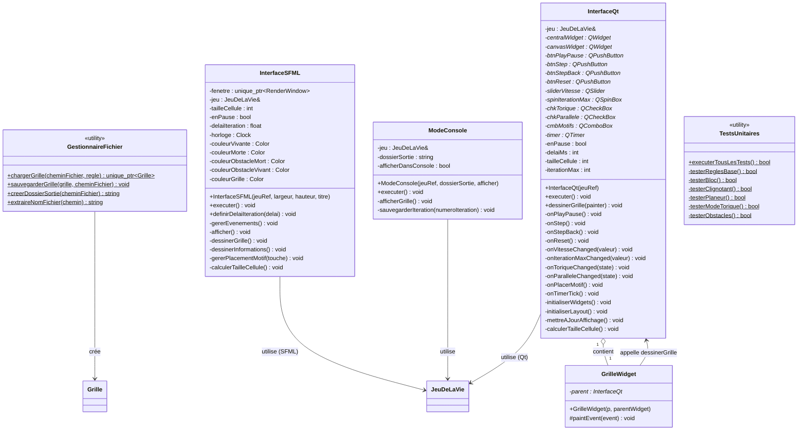
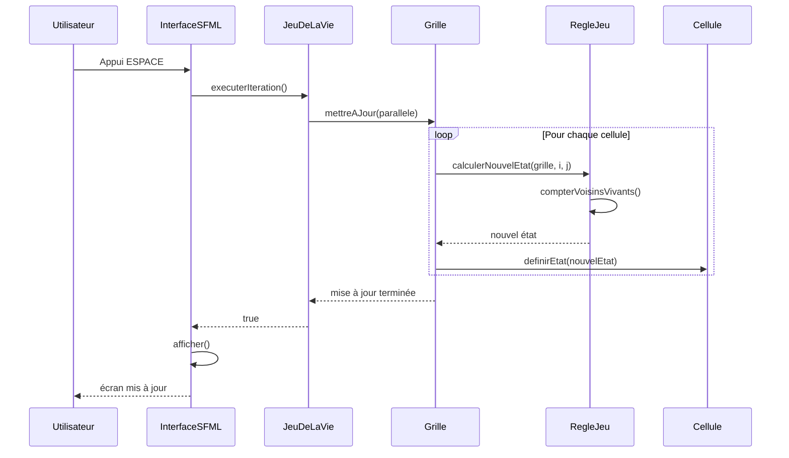
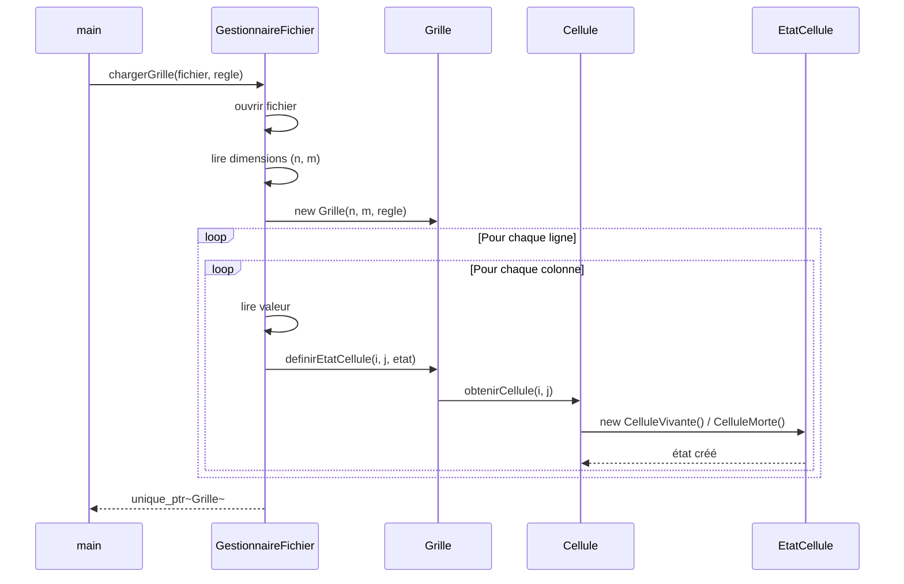
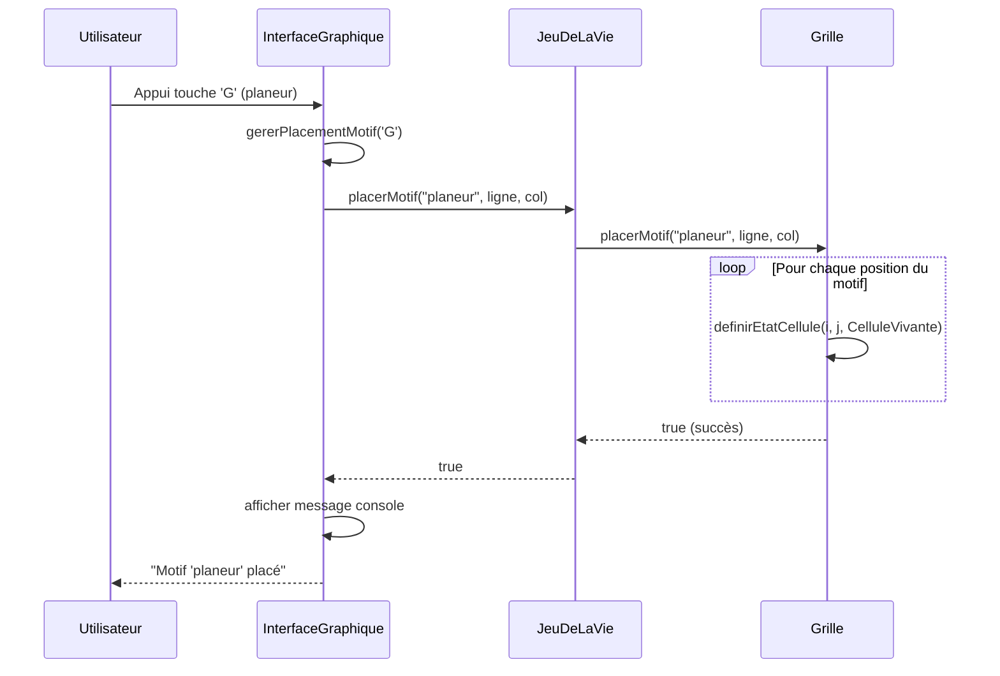
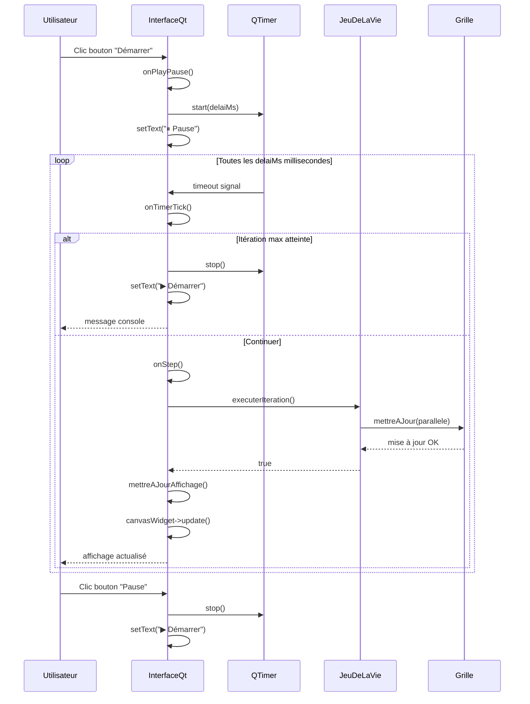
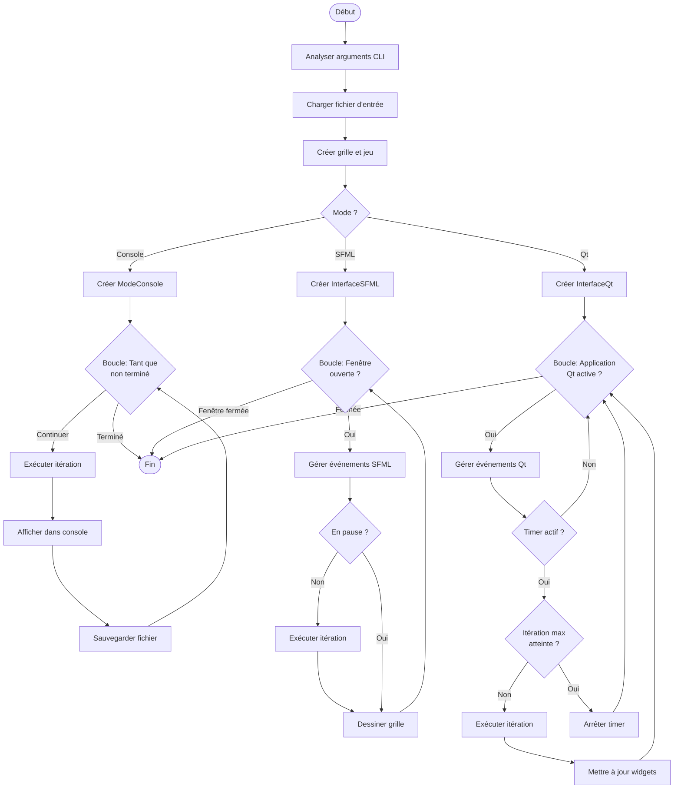
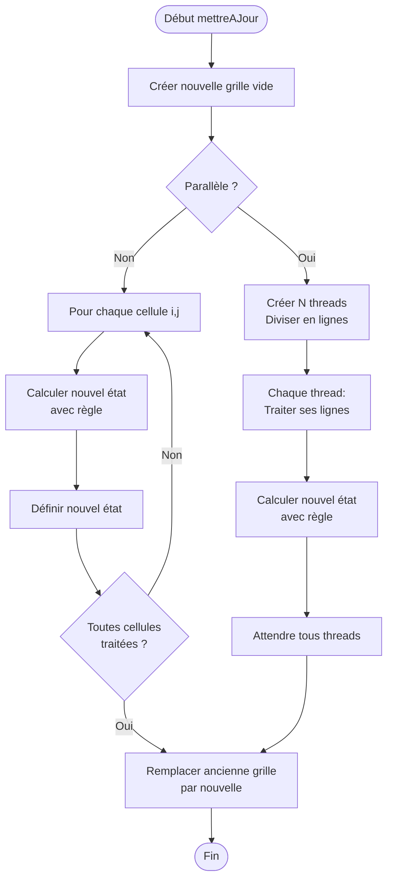

# Document de Conception - Jeu de la Vie

## 1. Diagramme de Classes (Mermaid)

### Hiérarchie des États de Cellules

### Hiérarchie des Règles du Jeu

### Architecture Principale

### Interfaces et Utilitaires

## 2. Diagramme de Séquence (Mermaid)

### Exécution d'une itération

### Chargement d'un fichier

### Placement de motif interactif

### Interface Qt - Interaction utilisateur

## 3. Diagramme d'Activité (Mermaid)

### Activité principale du programme

### Mise à jour de la grille avec parallélisation

## 4. Patterns de Conception Utilisés

### Strategy Pattern
- **RegleJeu** avec ses implémentations (RegleStandard, RegleTorique)
- Permet de changer les règles du jeu dynamiquement
- Utilisé dans `Grille` pour sélectionner le mode torique ou non

### State Pattern
- **EtatCellule** avec ses états concrets (CelluleMorte, CelluleVivante, CelluleObstacle)
- L'état d'une cellule détermine son comportement (vivante, morte, obstacle)
- Transition d'état gérée par les règles du jeu
- **CelluleObstacle** peut être vivant (orange) ou mort (rouge) et ne change jamais d'état pendant la simulation

### Template Method Pattern
- **RegleJeu::calculerNouvelEtat()** utilise **compterVoisinsVivants()**
- Chaque sous-classe implémente sa propre façon de compter les voisins
- RegleTorique compte les voisins avec grille bouclée

### Dependency Injection
- Les règles sont injectées dans la Grille via le constructeur
- L'interface graphique reçoit une référence au JeuDeLaVie
- Facilite les tests et la flexibilité

### Observer Pattern (implicite via événements Qt)
- InterfaceQt utilise le système de signals/slots de Qt
- Les boutons émettent des signaux connectés aux slots (onPlayPause, onStep, etc.)
- QTimer émet timeout signal pour l'animation automatique

### MVC Pattern (Model-View-Controller)
- **Model** : JeuDeLaVie, Grille, Cellule (logique métier)
- **View** : InterfaceSFML (SFML), InterfaceQt, ModeConsole (affichage)
- **Controller** : Gestion d'événements dans les interfaces

## 5. Justification des Choix Techniques

### Utilisation de unique_ptr et shared_ptr
- **unique_ptr** pour la propriété exclusive :
  - Cellule possède son EtatCellule
  - JeuDeLaVie possède sa Grille
  - Historique stocke des grilles uniques
- **shared_ptr** pour la propriété partagée :
  - Plusieurs grilles peuvent partager une règle (RegleJeu)

### Polymorphisme
- Les états et règles utilisent le polymorphisme pour permettre l'extensibilité
- Facilite l'ajout de nouveaux états (ex: CelluleEnCroissance) ou règles (ex: RegleHighLife)
- Respect du principe Open/Closed (SOLID)

### Séparation GUI/Logique
- La logique métier (Grille, Cellule, Règles) est complètement indépendante de l'affichage
- Facilite les tests unitaires
- Permet d'avoir 3 interfaces différentes (Console, SFML, Qt) sans dupliquer la logique

### Multithreading optimisé
- Utilisation de std::thread pour la parallélisation par lignes
- **Pas de mutex** : chaque thread travaille sur ses lignes exclusives
- Division du travail équitable entre threads (mettreAJourLignes)
- Gain de performance de ~15% sur grandes grilles (500x500+)

### Choix de Qt vs SFML
- **SFML** : Légère, rapide, idéale pour animation fluide et grandes grilles
- **Qt** : Interface professionnelle avec widgets natifs, contrôles riches
- Compilation conditionnelle : le projet compile avec l'une, l'autre, ou les deux

## 6. Complexité et Performance

### Complexité temporelle
- Mise à jour séquentielle: **O(n × m)** où n×m est la taille de la grille
- Mise à jour parallèle: **O((n × m) / p)** où p est le nombre de threads
- Comptage des voisins: **O(1)** (toujours 8 voisins à vérifier)
- Placement de motif: **O(k)** où k est la taille du motif

### Complexité spatiale
- Stockage de la grille: **O(n × m)**
- Grille temporaire lors de la mise à jour: **O(n × m)**
- Historique (undo): **O(h × n × m)** où h est le nombre d'itérations sauvegardées

### Optimisations implémentées
- **Réservation de mémoire** avec reserve() pour éviter les réallocations
- **Parallélisation sans mutex** : division par lignes complètes
- **Move semantics** avec std::move() pour éviter les copies coûteuses
- **Taille de cellule adaptative** : ajustée automatiquement selon la taille de grille
- **Calcul exact de fenêtre** : pas d'espace noir inutile (SFML/Qt)

### Benchmark (grille 1000×1000, 100 itérations)
- Mode séquentiel: ~2.5s
- Mode parallèle (8 threads): ~2.2s  
- Gain: **~15%** grâce à l'optimisation sans mutex
